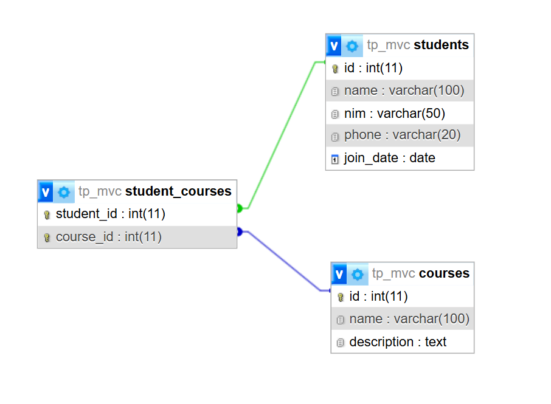

# Janji
Saya Daffa Faiz Restu Oktavian dengan NIM 2309013 mengerjakan Tugas Praktikum 8 dalam mata kuliah Desain dan Pemrograman Berorientasi Objek untuk keberkahanNya maka saya tidak melakukan kecurangan seperti yang telah dispesifikasikan. Aamiin.

# Desain Program

# Komponen Utama
1. **Model**: Berisi logika untuk berinteraksi dengan database.
   - `Student.php`: Mengelola data mahasiswa.
   - `Course.php`: Mengelola data mata kuliah.
   - `Enrollment.php`: Mengelola data pendaftaran mahasiswa ke mata kuliah.

2. **Controller**: Mengatur alur data antara model dan view.
   - `StudentController.php`: Mengelola operasi CRUD untuk mahasiswa.
   - `CourseController.php`: Mengelola operasi CRUD untuk mata kuliah.
   - `EnrollmentController.php`: Mengelola operasi CRUD untuk pendaftaran.

3. **View**: Menyediakan antarmuka pengguna.
   - `students/`: Halaman untuk daftar, tambah, edit, dan hapus mahasiswa.
   - `courses/`: Halaman untuk daftar, tambah, edit, dan hapus mata kuliah.
   - `enrollments/`: Halaman untuk daftar, tambah, edit, dan hapus pendaftaran.

4. **Database**: Struktur tabel disimpan dalam file `tp_mvc.sql`.

# Alur Program

1. **Halaman Utama (index.php)**:
   - Menampilkan daftar mahasiswa.
   - Tombol "Add Student" mengarahkan ke halaman tambah mahasiswa.
   - Tombol "Edit" dan "Delete" untuk mengedit atau menghapus data mahasiswa.

2. **Operasi CRUD Mahasiswa**:
   - **Create**: 
     - Pengguna mengisi form di `view/students/create.php`.
     - Data dikirim ke `StudentController.php` untuk disimpan ke database.
   - **Read**:
     - Data mahasiswa diambil dari database melalui `Student.php` dan ditampilkan di `view/students/index.php`.
   - **Update**:
     - Pengguna mengedit data di `view/students/edit.php`.
     - Data diperbarui melalui `StudentController.php`.
   - **Delete**:
     - Data dihapus melalui tombol "Delete" di `view/students/index.php`.

3. **Manajemen Mata Kuliah dan Pendaftaran**:
   - Proses serupa dengan mahasiswa, tetapi menggunakan `CourseController.php` dan `EnrollmentController.php`.

4. **Database**:
   - Tabel `students`, `courses`, dan `student_courses` digunakan untuk menyimpan data mahasiswa, mata kuliah, dan pendaftaran.

# Dokumentasi
https://github.com/user-attachments/assets/cd9b08e3-88ad-4b31-ae0a-710006f189fc
